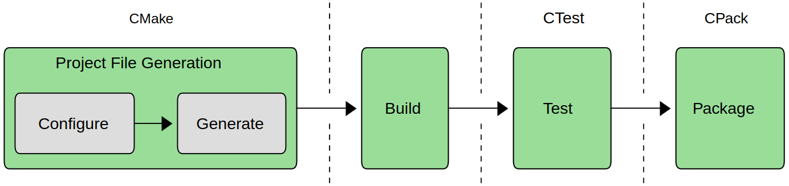

- O CMake é um conjunto de ferramentas para automatização do processo de *build* de softwares escritos em diferentes linguagens
	- 
	- Essencialmente, o CMake provê uma forma de configurar o processo de *build*, *test* e *package* de softwares
	- O processo de *build* é realizado por uma ferramenta específica
	- Os arquivos do project (*Project Files*) também são gerados por uma ferramenta específica (e.g., *ninja*, *Makefiles*, *Visual Studio*, *Xcode*)
- Organização geral de um projeto usando CMake
	- **<src>**
		- **CMakeLists.txt**: define o que deve ser construído e como
		- **<files and directories>**: códigos fonte
	- **<build>**: diretório para armazenamento de executáveis, bibliotecas, saídas dos testes e pacotes
		- Pode ser *in-source* (não recomendado) ou *out-source*
		- Normalmente não é versionado (lembrar de adicionar no gitignore caso o repositório completo seja versionado)
- [[Visão Geral do CMakeLists]]
- [[Variáveis no CMake]]
-
- Comandos
	- [[add_executable(...)]]
	- [[add_library(...)]]
	- [[target_link_libraries(...)]]
	- [[set(...)]]
	- [[unset(...)]]
	- [[message(...)]]
	-
- Referências
	- Professional CMake: A Practical Guide, Scott (2022)