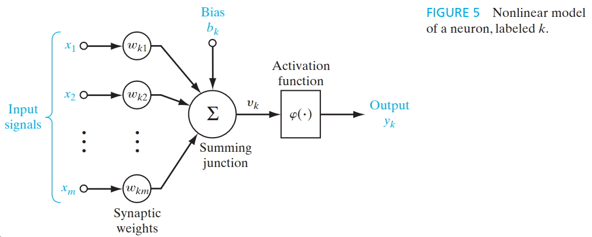
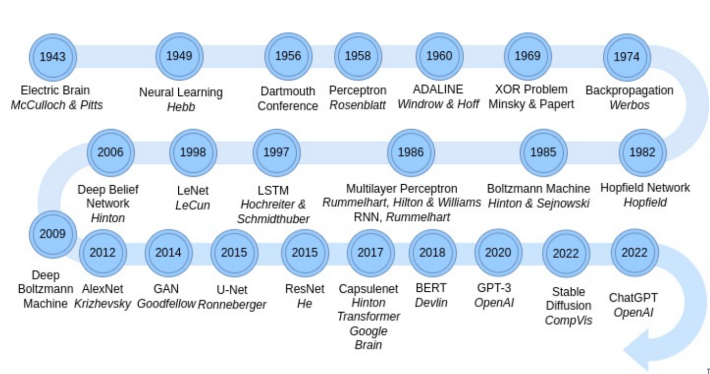

- Contexto Histórico
	- Surge como uma inspiração biológica do cérebro Humano
		- Mas antes, faz-se necessário conhecê-lo
		- Descoberta do Microscópio (~1590)
		- Descoberta da Célula (~1680)
		- Célula como unidade constituinte dos seres vivos (~1830)
		- Constituintes básicos do cérebro são neurônios (~1909)
	- Cérebro Humano
		- $10^{11}$ neurônios e $10^{14}$ sinapses/conexões
		- Apresenta em média $1000$ conexões por neurônio, podendo chegar até $10000$
		- Em seres humanos, 70% dos neurônios se encontram no córtex
		- O cérebro consome 20% da energia do corpo
	- Neurônio Biológico
		- 
		- Existem múltiplos tipos de neurônios, responsáveis por tarefas específicas
			- 
	- Redes Neurais Artificiais
		- McCulloch & Putts (1943)
			- Modelagem de um neurônio artificial com inspiração no cérebro humano
			- O neurônio tem um comportamento binário (ativo ou não ativo)
				- Seja $s(\vec{x}_t) = \sum_i x_{t,i} \cdot w_{t,i}$ a soma ponderada da entrada $\vec{x}_t$ para o neurônio artificial com pesos $\vec{w}_t$
					- Para um dado tempo $t$, seja $u_t = s(\vec{x}_t)$
				- Seja $h: \mathbb{R} \to \{0, 1\}$ uma função de ativação baseada em threshold com limiar $\theta \in \mathbb{R}$
					- Se $u_t \geq \theta$, $h(u_t) = 1$
					- Do contrário, $h(u_t) = 0$
			- Apenas com esse modelo simples já conseguimos implementar o funcionamento das portas lógicas AND, OR e NOT
		- Perceptron de Rosenblatt
			- Propôs uma nova modelagem do neurônio artificial, adicionando um *bias* $b_k$ e com maior relaxamento na função de ativação $\varphi$
			- {:height 285, :width 688}
		- ADALINE
		- Resolução do problema XOR
		- *Dark Age* -> baixa em IA
		- Perceptron Multi-camadas (MLP + Backpropagation)
		- Support Vector Machine (SVM)
		- Deep Neural Network (DNN)
		- 
- Como funciona uma Rede Neural na prática?
	- Exemplo em um problema de classificação de aceitação ou recusa de um estudante em uma Universidade
		- Podemos modelar como um problema de *otimização* para buscar a reta de separação entre os dados e depois utilizar esse limiar para seleção da classe
		- Essencialmente, podemos modelar esse problema utilizando o neurônio artificial simples de McCullho & Pitts
		- No final das contas, teríamos que buscar $\vec{w} = [w_0, w_1, w_2, \dots, w_n]$ de forma que a reta $\vec{w}^T \cdot \vec{x} = 0$, onde $\vec{x} = [1, x_1, x_2, \dots, x_n]$, **melhor** separasse os aprovados dos não aprovados
			- O **melhor** nesse caso pode ser definido matematicamente de diferentes formas
			- Por exemplo, podemos utilizar o caso da *regressão linear*
			- Também podemos utilizar diferentes outras *métricas*