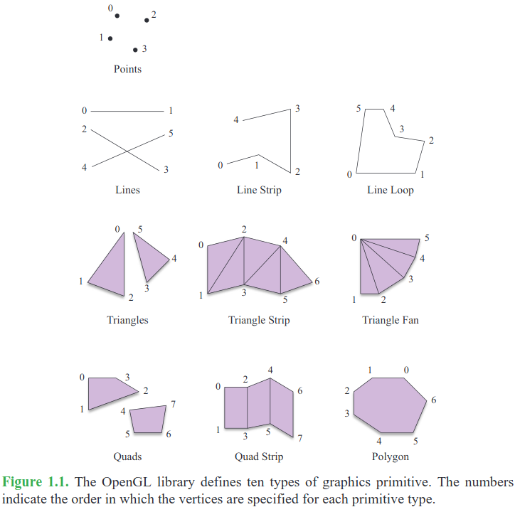
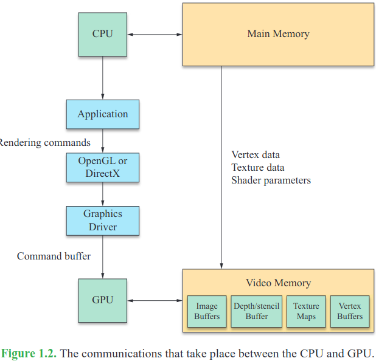
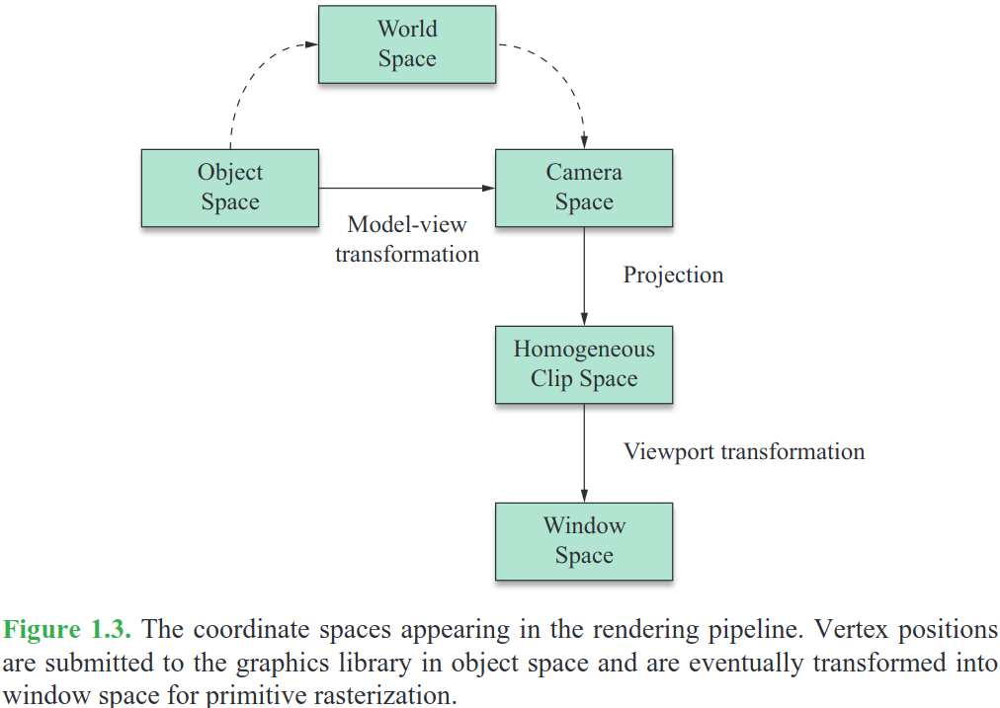
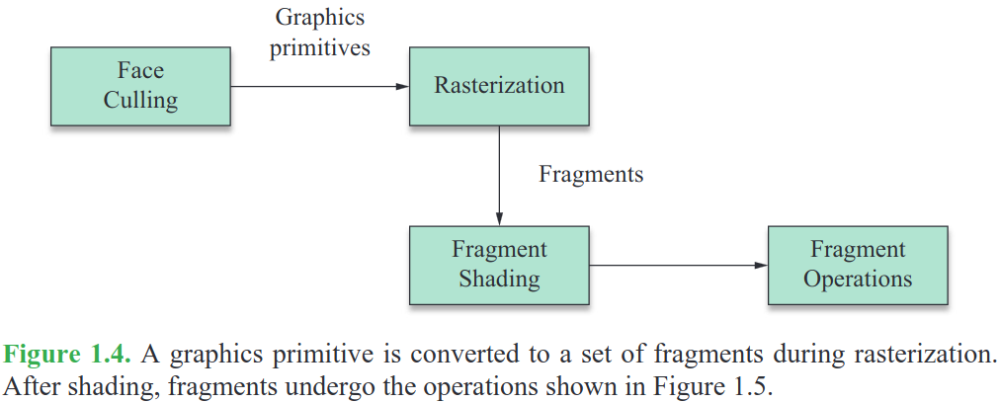
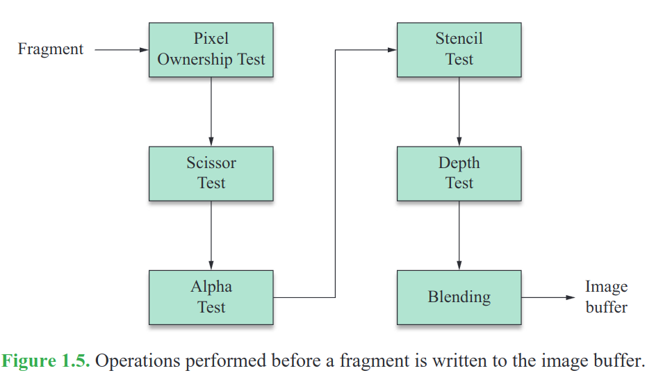

- > A typical scene that is to be rendered as 3D graphics is composed of many *separate objects*. The **geometrical forms** of these objects are each represented by a set of vertices and a particular type of **graphics primitive** that indicates how the vertices are connected to produce a shape.
	- 
	- Hardware gráfico são capazes de *renderizar*: (i) pontos individuais; (ii) segmentos de linha; (iii) polígonos.
- > The usual modern 3D graphics board possesses a dedicated **Graphics Processing Unit (GPU)** that executes instructions independently of the Central Processing Unit (CPU). The CPU *sends rendering commands* to the GPU, which then performs the rendering operations while the CPU continues with other tasks. This is called **asynchronous operation**.
	- Todavia, ainda é possível realizar a *sincronização* dessas operações (i.e., é possível pela CPU saber exatamente quando a GPU finalizou de executar os comandos passados ao custo de um impacto em performance)
	- > An application communicates with the GPU by sending commands to a rendering library, such as OpenGL, which in turn sends commands to a **driver** that knows how to speak to the GPU in its native language. The interface to OpenGL is called a *Hardware Abstraction Layer (HAL)*.
	- 
	  collapsed:: true
		- *Image Buffers*
			- *Front image buffer*: informações sobre os pixels visíveis no *viewport* (i.e., área contendo a imagem renderizada, pode ser uma sub-região de uma janela, a região completa da janela ou a região completa do display),
			- *Back image buffer*: região onde as informações da cena sendo renderizada são armazenadas
		- *Z-buffer* or *depth buffer*: para todo pixel no *image buffer*, um valor do quão distante esse pixel está em relação a câmera é armazenado aqui
		- *Stencil buffer*: contains an integer mask for each pixel in the image buffer that can be used to enable or disable drawing on a per-pixel basis.
		- *Textura Maps*: images that are applied to the surface of an object to give it greater visual detail.
- > Geometrical data is passed to the graphics hardware in the context of a three-dimensional space. One of the jobs performed by the graphics hardware is to transform this data into geometry that can be drawn int a two-dimensional viewport.
	- 
		- *Object space*: sistema de coordenadas que só é pertinente ao objeto em questão
		- *World space*: sistema de coordenadas que relaciona os múltiplos objetos em uma cena
		- *Camera/eye space*: sistema de coordenadas que alinha os eixos $x$, $y$ e $z$ à câmera
		- *Window Space*: sistema de coordenadas relacionados com o *viewport*
		-
- > Once a model’s vertices have been clipped and transformed into window space, the GPU must determine what pixels in the viewport are covered by each graphics primitive. The process of filling in the horizontal spans of pixels belonging to a primitive is called **rasterization**. The GPU calculates the depth, interpolated vertex colors, and interpolated texture coordinates for each pixel. This information, combined with the location of the pixel itself, is called a **fragment**.
	- 
	- 
- Referência(s)
	- Mathematics for 3D Game Programming and Computer Graphics, Lengyel (2011)