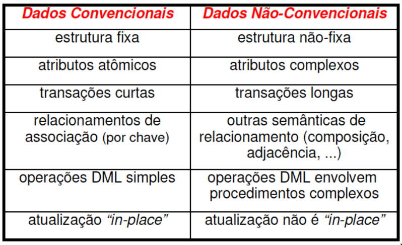

- Por qual motivos precisamos de Bancos de Dados Não Convencionais (Relacionais)?
	- **Principal:** necessidades do *Big Data* e Bancos de Dados extremamente performáticos
	- *BI* vs *Big Data*: não é uma competição! Cada área possui técnicas e objetivos diferentes
		- BI: olhar para o passado e entender o que aconteceu
		- Big Data: olhar para o futuro, o que podemos fazer? (e.g., modelos preditivos)
	- Quão "big"? **bilhões** (e mais) de dados gerados e coletados!
		- Menos de 1% dos dados são analisados (utilizados para geração de novos dados/informações)
	- Profissões de oportunidade: *Cientistas de Dados*, *Engenheiro de Dados*
		- Poucos profissionais quando comparado ao crescimento do volume de dados produzidos
		- Comunicação M2M para propagação de dados/informações
		- Computação em Nuvem: virtualização e conectividade
	- Mudanças de Paradigma: antes todos os dados eram Bancos Relacionais, hoje eles estão em diversos locais e são **heterogêneos**.
		- E normalmente, esses dados são não-estruturados (e.g., imagens, áudio) ou semi-estruturados (e.g., JSON)
		- Dados agora são não-corporativo e móveis
	- Vs do Big Data: velocidade, volume, veracidade e variedade
		- Outras fontes adicionam Vs
		- A ideia é conseguir definir *big data*
	- O que é Big Data?
		- O que não é: não significa simples maior volume ou que modelos anteriores não eram capazes de lidar
		- Dessa forma, o Big Data é um novo paradigma classificado por um novo cenário tecnológico, social e econômico, com dados estruturados, não-estruturados, semi-estruturados, móveis, não-corporativos
		- Diferenças
			- Natureza dos Dados: 3 grandes classes
			- Economia de Escala
			- Novas Tecnologias
		- Arquiteturas em geral são várias etapas, podemos modelar como um grafo direcionado
			- Ingestão -> Lago de Dados (Data Lake)
				- -> Data Marts <-> Inteligência Operacional
				- -> Dados Corporativos (Relacional)
					- -> Data Marts
					- -> Inteligência Operacional
					- -> BI Tradicional (Visualização)
				- -> Aplicativos
	- Big Data: perguntas que buscamos responder
		- Quem é o dono dos dados?
		- Quem disponibiliza a infraestrutura?
		- Qual o perfil da mão de obra para gerar/manter aplicativos? (e.g., Cientista de Dados)
			- Normalmente, Cientista de Dados trabalham sobre os dados permitindo seu uso pelo aplicativo
			- Hoje, já começou a se separar o Cientista do Engenheiro de Dados, similar ao que ocorreu com BI
- DBA -> Database Administrator, responsável por gerenciar o datacenter
	- Depois, surgiu-se um profissional responsável por fazer projetos que facilitassem o trabalho dos desenvolvedores relacionados com as aplicações (normalmente)
	- Hoje, também temos o Engenheiro de Dados que é responsável de quebrar os dados facilitando o trabalho da próxima equipe
- Sugestão: Gartner Hype Cycle
- Big Data não é uma tecnologia!! É um novo paradigma
- **Escalabilidade**: é possível preservar o desempenho quando há um aumento significativo de sua demanda através do aumento de recursos
	- **Vertical**: aumento dos parâmetros de velocidade, armazenamento ou memória
	- **Horizontal**: uso de recursos individuais distribuídos integrados como um único sistema
	- 
- **Modelos não convencionais e não relacionais de dados** são necessários para o Big Data, também é necessário compreender que os dados normalmente possuem alto volume e são *contínuos*
- Modelos BDNCs também são chamados de **pós-relacionais**
	- Aplicações de BDs relacionais
		- Folha de Pagamento
		- Automação Bancária
		- Controle de Estoque
		- **DBMS**es: Postgres, MySQL, MariaDB
		- Os dados são orientados à registros estruturados, transações costumam ser de curta duração e através de DMLs (Data Manipulation Languages)
	- Com o tempo, foram surgindo aplicações que não se encaixavam nas características convencionais como: CAD/CAM, Sistemas de Informação Geográficos, Aplicações de Consulta na Web, Sistemas de Hipermídia
		- Antes, esses casos eram considerandos "não-convecionais"
	- Nesse contexto, tínhamos as seguintes diferenças: 
	  
	- BDNCs comuns
		- BD Orientado a Objetos (BDOO)
		- BD Temporal (BDT)
		- BD Geográfico (BDG)
		- BD XML
		- Alto Desempenho
		- NoSQL
		- NewSQL: SQL tradicional agregando funcionalidades de Big Data e NoSQL